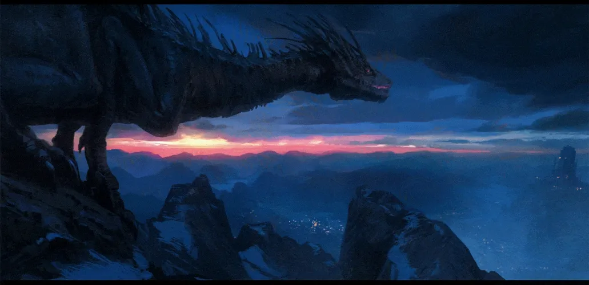

## Hi there 👋

  

Greetings, digital warriors and cyber defenders! I'm WarmBrew, a relentless crusader in the realm of cybersecurity. With fire in my heart and code in my veins, I battle the dark forces that threaten our digital existence. 🔥

### About Me
- 🔭 I’m currently working on identifying and mitigating critical CVE vulnerabilities at SecureTech Solutions.
- 🌱 I’m currently learning advanced penetration testing techniques and malware analysis to stay ahead of the curve.
- 👯 I’m looking to collaborate on innovative security solutions and threat intelligence projects to make the digital world safer.
- 💬 Ask me about anything related to cybersecurity, CVE vulnerability management, or the latest in threat hunting strategies.
- 📫 How to reach me: warmbrew
- 😄 Pronouns: He/Him
- ⚡ Fun fact: When I'm not hunting vulnerabilities, I'm an avid rock climber and enjoy challenging myself with complex routes.
- 🤓 Member of the EU Information Security Hall of Fame

### My Interests
- 🕵️‍♂️ Vulnerability Research
- 🛡️ Red Team Operations
- 🏆 CVE Contributions
- 🎮 HackTheBox Player
- 🐱‍💻 Hacker on HackerOne

### CVE 
- CVE-2024-39178
- CVE-2024-30801
- CVE-2024-30802
- CVE-2024-28256
- CVE-2024-28257
- CVE-2024-22547
- CVE-2023-24184
- CVE-2024-42676
- CVE-2024-42677
- CVE-2024-42678
- CVE-2024-42679
- CVE-2024-42680
- CVE-2024-44756
- CVE-2024-44757
- CVE-2024-44758
- CVE-2024-44759
- CVE-2024-44760
- CVE-2024-44761
- CVE-2024-54702
- CVE-2024-54704
- CVE-2024-54706
- CVE-2024-54707
- CVE-2024-54708
- CVE-2024-54709
- CVE-2024-54712
- CVE-2024-54716
- CVE-2024-54717
- CVE-2024-54718
- CVE-2024-54723

### My GitHub Contributions

Together, we can forge an unbreakable shield against the dark forces lurking in the shadows. Join me in this epic quest for cybersecurity dominance! 🛡️

  

Stay vigilant, stay secure.
---
